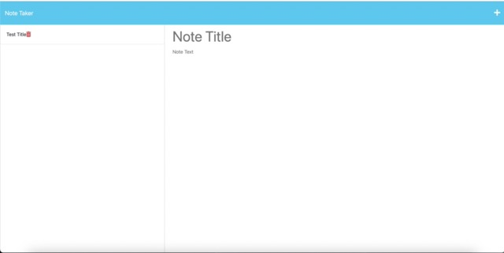

# Note Taker

  

  ## Table-of-Contents

  * [Description](#description)
  * [Installation](#installation)
  * [Usage](#usage)
  * [License](#license)
  * [Contributing](#contributing)
  * [Tests](#tests)
  * [Questions](#questions)
  
  ## [Description](#table-of-contents)

  This web application utilizes Express.js to provide an online note taker for busy people to quickly and efficiently take and save notes.

  ## [Installation](#table-of-contents)

  To install this project, clone the repository's code, open in VS Code, and run node server in the terminal.

  ## [Usage](#table-of-contents)

  Click the + button on top right of the screen to create a new note, Enter a title, write your note in the body, and press the save button. To delete a note, press the red trash can next to the note.

  The following is a screen shot of the webpage:
  
   

  ## [Contributing](#table-of-contents)
  
  
    Thank you for your interest contributing; however, right now, I will not be accepting outside contributions.
      

  ## [Questions](#table-of-contents)

  Please contact me using the following links:

  [GitHub](https://github.com/colint771)

  [Email: colint771@gmail.com](mailto:colint771@gmail.com)
